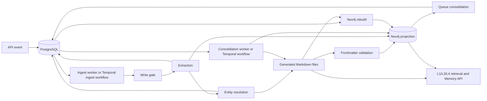

# Generated Markdown Memory Lifecycle and Replacement Plan

**Repository:** Engram  
**Analysis date:** 2026-09-09  
**Scope:** Generated memory files under the configured `filesystem.data_dir`

## 1. Purpose

This document explains exactly how generated Markdown memory files participate in
ingestion, consolidation, retrieval, lifecycle operations, and Neo4j recovery. It
also explains what happens when an existing entity receives updated information
and provides a safe architecture and migration plan for removing generated `.md`
memory files.

This document is about generated runtime artifacts such as:

```text
data/mem/<tenant-id>/user/entities/angie-jones/angie-jones.md
data/mem/<tenant-id>/user/episodes/2026-09-09_<summary>.md
data/mem/<tenant-id>/user/facts/<event-id>/<fact>.md
data/mem/<tenant-id>/user/session_summaries/<session-id>.md
data/mem/<tenant-id>/user/entities/angie-jones/overview.md
```

It is **not** a proposal to remove:

- repository documentation under `docs/`;
- `README.md` files;
- Markdown accepted as user input;
- Markdown rendering in API or UI responses.

## 2. Executive conclusion

The generated Markdown files cannot be deleted safely from the current system.
They are not just exports. The code explicitly treats the filesystem as the
canonical memory store, and several runtime paths read or modify the files
directly.

The current ownership model is:

| Data | Current durable owner | Purpose |
|---|---|---|
| Full memory body and frontmatter | Generated Markdown files | Canonical node content and lifecycle metadata |
| Events, extractions, linked entity IDs, queues | PostgreSQL | Control plane, replay input, and workflow state |
| Search embeddings, graph nodes, semantic edges | Neo4j | Search and graph traversal projection |
| Session working state and overview cache | Redis | Ephemeral/cache state |
| Background execution | Temporal when enabled | Durable orchestration, not canonical data storage |

The recommended target is:

- **PostgreSQL** becomes the canonical structured memory store;
- **Neo4j** remains a rebuildable graph/search projection;
- **Redis** remains an optional cache and transient session store;
- **Temporal** orchestrates background operations;
- generated Markdown becomes an optional one-way export only.

Neo4j should not directly replace the Markdown files as the canonical store. A
graph database is valuable for relationship traversal, but PostgreSQL is a better
place for transactional versions, claims, provenance, aliases, lifecycle state,
and an outbox used to rebuild projections.

## 3. Two different meanings of “temporal”

These names refer to different things:

| Name | Meaning | Does it read/write Markdown? |
|---|---|---|
| Temporal | External workflow engine used to execute ingest and background workflows | It runs code that may use Markdown; Temporal itself does not store memory bodies |
| `TEMPORALIZE` | Consolidation task that detects an ISO date and adds a `temporal` map to YAML frontmatter | Yes, it directly reads and rewrites a target memory file |

Enabling Temporal does not automatically run every semantic consolidation stage.
It only changes how queued work is executed. The application still decides which
task types to enqueue.

## 4. Current end-to-end data flow



This creates a split-source design:

1. the file contains the full text and frontmatter;
2. the control-plane database contains extraction and workflow records;
3. Neo4j contains the searchable graph projection;
4. a correct answer may require data from more than one of these stores.

## 5. File format and physical storage

### 5.1 `mem://` is currently both identity and location

`FilesystemStore.path_for()` converts a tenant-relative `mem://` URI into a path
under the current tenant directory. For example:

```text
mem://user/entities/angie-jones/angie-jones.md
```

maps to:

```text
<data_dir>/<tenant-id>/user/entities/angie-jones/angie-jones.md
```

This means the logical identifier exposes a physical storage decision, including
the `.md` extension and directory layout. See
[`FilesystemStore`](../engram/storage/filesystem.py#L23) and
[`path_for`](../engram/storage/filesystem.py#L48).

### 5.2 Write behavior

`write_atomic()` performs:

1. URI-to-path resolution;
2. parent-directory creation;
3. write to a temporary sibling file;
4. file `fsync`;
5. atomic `os.replace`;
6. parent directory `fsync` on non-Windows systems.

This protects one individual file from a partial write. It does **not** provide a
transaction across PostgreSQL, multiple files, Neo4j, and the task queue.
See [`write_atomic`](../engram/storage/filesystem.py#L52).

### 5.3 File structure

Memory files consist of YAML frontmatter followed by a Markdown body:

```markdown
---
id: <uuid>
node_type: ENTITY
status: ACTIVE
created_at: <ISO timestamp>
source_session_id: <session id>
schema_version: 1
normalize:
  canonical_name: Angie Jones
  aliases:
    - Angie Jones
provenance:
  extractor: core_model_v1
  confidence: 0.9
  ingest_event_id: <event id>
---
Angie Jones (entity).

<abstract captured when the entity file was first created>
```

Serialization, parsing, required keys, and reserved metadata validation live in
[`frontmatter.py`](../engram/frontmatter.py#L18).

## 6. Ingestion: every stage involving Markdown

The main ingest sequence is in
[`process_event`](../engram/ingest/worker.py#L60) and
[`_process_event`](../engram/ingest/worker.py#L114).

### Stage 1 — record the event

The API stores the raw event in the configured control-plane database. No memory
Markdown is created yet.

All environments use PostgreSQL. The configuration requires
`event_ledger.backend=postgres` and a valid `event_ledger.dsn`.

### Stage 2 — write-path gate

The model decides whether the conversation contains durable information worth
storing.

- `store=false`: event becomes `GATED_SKIP`; no memory file is written.
- `store=true`: event becomes `GATED_STORE`; processing continues.
- model error: event fails before memory-file creation.

Reference: [write-path gate](../engram/ingest/worker.py#L127).

### Stage 3 — extract resolved text, abstract, and triplets

The extraction model returns:

- `resolved_text`: standalone text with contextual references resolved;
- `l0_abstract`: short summary used by search/indexing;
- `triplets`: subject, relation, object, and confidence.

The extraction is saved in the control-plane database, not in Markdown at this
stage. Later stages use it to generate files and graph records. Existing extraction
rows are reused on retry. Reference:
[`_call_extract`](../engram/ingest/worker.py#L255).

### Stage 4 — resolve entities

Every distinct triplet subject **and object** is treated as an entity candidate.
The code:

1. reads every triplet;
2. takes both `subject` and `object` strings;
3. slugifies the string;
4. removes duplicate slugs inside the event;
5. asks the entity linker to find an existing Neo4j entity;
6. returns a matched URI or marks the candidate as new.

Reference: [`_resolve_entities`](../engram/ingest/worker.py#L272).

Important consequences:

- a person or company can become an entity;
- a job title can also become an entity;
- an ISO date can also become an entity;
- failure or uncertainty in the linker defaults to creating a new entity.

The current model does not first classify values as `ENTITY`, `DATE`, `NUMBER`,
`ROLE`, or another typed literal. This is why entity directories can contain
roles, dates, and phrases that should instead be claim values.

### Stage 5A — write the episode file

The episode URI is derived from the current UTC date and a slug of the abstract:

```text
mem://user/episodes/<date>_<abstract-slug>.md
```

The file receives a new UUID, creation time, provenance, the abstract, and the
resolved text. Reference:
[`_write_episode`](../engram/ingest/worker.py#L321).

Retry risk: this filename is content/date based instead of event-ID based. Replaying
the same event writes the same URI with a newly generated UUID and timestamp. It
can overwrite metadata added after the first write, including temporal metadata.

### Stage 5B — write new entity files

For a new entity, ingestion writes:

```text
mem://user/entities/<slug>/<slug>.md
```

Its body contains the display name and the event abstract. Reference:
[`_write_entity`](../engram/ingest/worker.py#L350).

For an entity already matched by the linker, ingestion does not call
`_write_entity`; it reuses the matched URI. Even if `_write_entity` is called for
an already existing URI, it returns immediately:

```python
if ctx.fs.exists(uri):
    return uri
```

Therefore, an entity Markdown file is normally a **first-mention snapshot**, not a
current profile.

### Stage 5C — record the filesystem outbox and linked entities

After writing the episode and any new entity files, ingestion:

1. writes an `fs_outbox` record for the episode;
2. records the subject/object URI chosen for each triplet in `linked_entities`.

Reference:
[`_record_linked_entities`](../engram/ingest/worker.py#L382).

The operation is not one atomic transaction with the preceding file writes. A
failure after a file write but before the database writes can leave orphaned files.

### Stage 6A — validate generated frontmatter

The code reads the episode and entity files back, parses their YAML, checks
required keys, and validates reserved metadata types. Reference:
[`_validate_written_frontmatter`](../engram/ingest/worker.py#L587).

This validates the shape of the file. It does not verify that the file body is
semantically current, consistent with Neo4j, or transactionally committed with the
control-plane rows.

Low-confidence fact files are created later while graph indexing is running, so
they are not part of this initial episode/entity validation loop.

### Stage 6B — index Neo4j

Neo4j receives:

- an episode node;
- entity nodes;
- embeddings and L0 abstracts;
- semantic `RELATES_TO` edges;
- episode-to-entity `REFERENCES` edges;
- active/historical conflict state.

Reference: [`_index_neo4j`](../engram/ingest/worker.py#L404).

Neo4j does not normally receive the complete Markdown body. It stores the
`source_uri` used to locate the file and a short abstract used for search.

The UUID stored for an episode/entity in Neo4j is independently generated in this
path and can differ from the UUID in the file. In practice, `source_uri` is the
cross-store identity.

### Stage 6C — write low-confidence fact files

A triplet with confidence from `0.3` through below `0.6` is not added as a normal
semantic relationship. It becomes a generated FACT file:

```text
mem://user/facts/<event-id>/<triplet-index>_<relation>_<object>.md
```

The file is marked `LOW_CONFIDENCE`, then a Neo4j fact node and reference edges
are created. Reference:
[`_write_low_confidence_fact`](../engram/ingest/worker.py#L512).

Triplets below `0.3` are ignored by graph indexing.

### Stage 7 — enqueue consolidation

Successful ingestion automatically queues only these task types for touched
directories:

- `CONSOLIDATE_OVERVIEW`;
- `REGENERATE_MANIFEST`;
- `PROPAGATE_OVERVIEW`.

Reference:
[`_enqueue_consolidation`](../engram/ingest/worker.py#L603).

Ingestion does **not** automatically queue the complete semantic chain of
`ATOMIZE`, `NORMALIZE`, `TEMPORALIZE`, and `INTEGRATE`.

## 7. What happens when an existing entity is updated?

Assume the first event says:

```text
Angie Jones is a Senior Test Automation Engineer at TechNova.
```

Later, another event says:

```text
Angie Jones became Director of Quality Engineering at TechNova,
effective 2026-09-01.
```

The current behavior is:

1. the second event is independently gated and extracted;
2. `Angie Jones` is resolved against Neo4j;
3. if resolution succeeds, the existing Angie URI is reused;
4. a new episode Markdown file is written for the update;
5. Angie’s existing entity Markdown file is **not updated**;
6. linked-entity rows connect the new triplets to the existing Angie URI;
7. Neo4j receives the new relationships;
8. conflict handling may mark an old edge historical if the normalized relation
   is recognized as the same predicate;
9. the entity overview may be regenerated using child abstracts and graph edges;
10. L2 graph retrieval can see the new relationships, while L4 file retrieval can
    still see the old first-mention body.

This is the central consistency problem:

```text
entity Markdown body = first-mention snapshot
Neo4j relationships   = later structured updates
overview.md           = model-generated summary of files plus graph relationships
```

If semantically equivalent relations use different labels, such as `has_role` and
`holds_role`, conflict resolution can retain both as active unless normalization
produces and indexing consumes the same canonical relation.

## 8. Consolidation: task-by-task Markdown behavior

The handler implementations are in
[`consolidation/tasks.py`](../engram/consolidation/tasks.py#L38).

### 8.1 `REGENERATE_MANIFEST`

This task:

1. resolves the target directory URI to a filesystem directory;
2. lists immediate children;
3. reads the first useful line of a child file or the summary of a child directory;
4. writes a plain-text `.manifest` file in that directory.

It is entirely filesystem-driven. A database-only replacement must provide an
equivalent hierarchy query and summary projection. Reference:
[`handle_regenerate_manifest`](../engram/consolidation/tasks.py#L38).

Potential issue: normal child listing hides dotfiles but not `overview.md`, so an
existing overview can be treated as an ordinary child when regenerating summaries.

### 8.2 `CONSOLIDATE_OVERVIEW`

This task:

1. lists child files/directories from the filesystem;
2. reads abstracts from those children;
3. obtains relationships for the children from Neo4j;
4. asks the core model to generate a directory overview;
5. writes `<directory>/overview.md`;
6. invalidates the Redis overview cache if configured;
7. records `overview_generated_at` on the Neo4j directory node.

Reference:
[`handle_consolidate_overview`](../engram/consolidation/tasks.py#L66).

The overview is derived data, but it is persisted as a generated Markdown file and
is used directly by L3 retrieval.

### 8.3 `PROPAGATE_OVERVIEW`

This task walks from the touched node toward its ancestors and queues additional
`CONSOLIDATE_OVERVIEW` work. It does not directly write Markdown, but its queued
tasks do. Reference:
[`handle_propagate_overview`](../engram/consolidation/tasks.py#L133).

### 8.4 `ATOMIZE`

This task splits compound triplet objects such as “A and B” into independent
triplets and updates the extraction row in the control-plane database.

It does not directly read or write a memory file. Its result becomes visible in
the graph only after reintegration. Reference:
[`handle_atomize`](../engram/consolidation/tasks.py#L161).

### 8.5 `NORMALIZE`

This task:

1. reads relevant extraction triplets from the control-plane database;
2. compares names with Neo4j entities using embeddings;
3. maps relation aliases to a controlled vocabulary;
4. adds `subject_canonical`, `object_canonical`, or `relation_canonical` fields;
5. writes revised triplet JSON back to the control-plane database.

It does not directly modify Markdown. Reference:
[`handle_normalize`](../engram/consolidation/tasks.py#L201).

Current integration indexing reads the original `subject`, `object`, and
`relation` fields. Merely adding `_canonical` fields is insufficient unless the
replay path intentionally consumes them.

### 8.6 `TEMPORALIZE`

This task directly modifies one memory file:

1. confirms the URI exists on the filesystem;
2. reads and parses the file;
3. returns if `temporal.valid_from` already exists;
4. inspects only the first non-empty body line;
5. extracts an unambiguous ISO date;
6. adds `asserted_at`, `valid_from`, `valid_until`, and `phrase` to frontmatter;
7. atomically rewrites the file.

Reference:
[`handle_temporalize`](../engram/consolidation/tasks.py#L249).

An episode’s first body line is its abstract, so temporalization can work when the
abstract contains an ISO date. An entity file’s first body line is normally
`<name> (entity).`, so an entity update date later in its body is normally missed.

### 8.7 `INTEGRATE`

This task does not directly write Markdown. It marks the filesystem outbox row as
`WRITTEN` and requeues affected ingest events so extraction changes are replayed.
Reference: [`handle_integrate`](../engram/consolidation/tasks.py#L281).

The replay executes the broader ingest path. Consequently, it can rewrite the
episode file and replace its frontmatter with freshly generated metadata. A
`TEMPORALIZE` followed by `INTEGRATE` can therefore lose the temporal fields added
to the episode file.

### 8.8 `UNMERGE`

This task invokes entity unmerge logic that:

- reads the merged entity Markdown body;
- asks the model to split it;
- writes new entity Markdown files;
- marks the merged source historical;
- updates Neo4j;
- queues manifest and overview regeneration.

This path must be database-backed before generated Markdown can be removed.
Reference: [`handle_unmerge`](../engram/consolidation/tasks.py#L302).

### 8.9 Automatic versus manual consolidation

| Task | Automatically queued by normal ingest? | Markdown dependency |
|---|---:|---|
| `CONSOLIDATE_OVERVIEW` | Yes | Reads children, writes `overview.md` |
| `REGENERATE_MANIFEST` | Yes | Reads children, writes `.manifest` |
| `PROPAGATE_OVERVIEW` | Yes | Queues file-dependent overview tasks |
| `ATOMIZE` | No | No direct file I/O |
| `NORMALIZE` | No | No direct file I/O |
| `TEMPORALIZE` | No | Reads and rewrites one file |
| `INTEGRATE` | No | Requeues ingest, which writes files |
| `UNMERGE` | Manual/API-driven | Reads and writes entity files |

All registered task types can run through Temporal when the production Temporal
integration is enabled. That does not mean all task types are automatically
scheduled after every ingest.

## 9. Retrieval: level-by-level Markdown behavior

### L0 — classify and plan

The query classifier and planner decide whether long-term memory is required and
how deeply to search. They do not need Markdown content themselves.

### L1 — shallow discovery

L1 can use embeddings from Neo4j, but hierarchy/tree rendering and filesystem
navigation read directory/file structure and first-line abstracts. Therefore L1 is
not completely file-independent.

### L2 — graph search and traversal

L2 primarily uses Neo4j for:

- vector search;
- entity neighbors;
- relation traversal;
- history chains;
- child queries.

This level normally does not require the full file body. It can return newer graph
facts than an entity Markdown file contains.

### L3 — overview retrieval

The `overview` command calls `FilesystemStore.read_overview()` and reads
`overview.md`. The full overview is added to retrieval context. Reference:
[`_execute_commands`](../engram/retrieval/orchestrator.py#L390).

L3 cannot remain unchanged after files are removed. `memory_overviews` or an
equivalent database representation must replace `overview.md` reads.

### L4 — full memory retrieval

The `cat` command and deep context assembly read the full source URI from the
filesystem, parse frontmatter, and use the Markdown body. Retrieval separately
reads frontmatter to decide whether a memory is `ACTIVE`, `HISTORICAL`, or
`LOW_CONFIDENCE` and to obtain confidence. References:
[`_read_full_body`](../engram/retrieval/orchestrator.py#L573) and
[`_status_for`](../engram/retrieval/orchestrator.py#L582).

L4 is directly dependent on the generated files.

### Retrieval consistency consequence

For an updated existing entity:

- L2 can find the current graph edge;
- L3 can contain a recent synthesis if consolidation completed;
- L4 can read the old entity body;
- if the overview task is delayed or stranded, L3 can also be stale.

The answer quality therefore depends on which level the planner selects and which
store is freshest.

## 10. Other runtime dependencies on generated Markdown

### 10.1 Memory API

The memory detail endpoint reads and parses the file for its body/frontmatter,
then separately queries Neo4j for outgoing edges. The response can combine a stale
body with current graph edges.

The retire endpoint changes `status` to `HISTORICAL` in the file and then attempts
to update Neo4j. These two changes are not one transaction. The list endpoint has
a recursive filesystem fallback that scans `*.md` when Neo4j is unavailable. See
[`memories.py`](../engram/api/routes/memories.py#L41).

### 10.2 Session commit

Session commit directly writes:

```text
mem://user/session_summaries/<session-id>.md
```

and then creates the Neo4j projection. This is a synchronous session lifecycle
path, not one of the normal consolidation tasks. Reference:
[`_write_session_summary_node`](../engram/session/manager.py#L289).

### 10.3 Neo4j disaster recovery

`rebuild-kg` currently:

1. deletes all Neo4j `Node` records;
2. recursively walks every generated `.md` file;
3. parses frontmatter and the first body line;
4. reconstructs nodes and containment edges;
5. reads extractions and linked entities from the control-plane database;
6. reconstructs semantic edges.

The files and database are jointly required for reconstruction. Deleting files
would make complete Neo4j rebuilding impossible with the current implementation.
Reference: [`rebuild`](../engram/rebuild_kg.py#L34).

### 10.4 Deployment

Because both API and background workers read/write the same canonical filesystem,
production currently needs a shared persistent volume with compatible multi-writer
semantics. Removing the volume before all readers and writers are migrated would
break ingestion, L3/L4 retrieval, memory APIs, consolidation, session summaries,
unmerge, and graph reconstruction.

## 11. Observed Angie Jones test

A production-style live test was run on 2026-09-09 with a fictional Angie Jones
record.

### Initial event

The successful initial event stated that Angie Jones was a Senior Test Automation
Engineer at TechNova and started on 2026-08-15.

### Update event

The successful update stated that Angie became Director of Quality Engineering for
Project Helios at TechNova, effective 2026-09-01.

### Observed result

- both events resolved Angie to the same URI:
  `mem://user/entities/angie-jones/angie-jones.md`;
- the Angie entity Markdown body remained the first-mention snapshot;
- new role, project, and date relationships appeared in Neo4j;
- the old `started_on` edge became historical and the new date became active;
- the older `has_role` edge and newer `holds_role` edge both remained active because
  their relation labels were different;
- the regenerated overview described the ambiguity using graph information;
- the Memory API returned the stale entity body together with current edges;
- a natural-language retrieval query returned the correct new role and date because
  the graph path supplied the current relationships.

This confirms that entity resolution can reuse an existing identity, but the
canonical file does not behave like an updated, versioned person record.

## 12. Current design risks

| Priority | Risk | Impact |
|---|---|---|
| Critical | File/database/Neo4j writes are not one transaction | Orphan files and cross-store inconsistency after partial failure |
| Critical | Entity files are first-mention snapshots | Full-body retrieval and Memory API can show obsolete information |
| Critical | Neo4j rebuild requires `.md` files | Files/PVC cannot yet be removed |
| High | Linker failure defaults to creating an entity | Duplicate and low-quality entities proliferate during outages or ambiguity |
| High | All triplet objects become entity candidates | Dates, job titles, and phrases pollute the entity graph |
| High | Replay rewrites episode identity/frontmatter | UUIDs, timestamps, and temporal metadata are unstable |
| High | Normalized `_canonical` fields are not consistently consumed | Semantic duplicates and unresolved conflicts remain active |
| High | L2 and L4 use different freshness sources | Retrieval result depends on selected depth |
| Medium | Existing `overview.md` can enter its own child input set | Feedback and summary drift across repeated consolidation |
| Medium | File status and graph status update separately | Retire/unmerge can partially succeed |
| Medium | Shared filesystem is required by multiple replicas | Deployment and scaling require multi-writer persistent storage |

## 13. Recommended replacement architecture

### 13.1 Canonical PostgreSQL model

Use PostgreSQL as the source of truth with tables similar to:

#### `memory_nodes`

Stores stable memory identity and current lifecycle state.

```text
id UUID PRIMARY KEY
tenant_id UUID/TEXT NOT NULL
memory_type ENUM/validated TEXT
canonical_uri TEXT UNIQUE
status ENUM/validated TEXT
created_at TIMESTAMPTZ
updated_at TIMESTAMPTZ
current_version_id UUID
```

#### `memory_versions`

Stores immutable body revisions instead of overwriting a file.

```text
id UUID PRIMARY KEY
memory_id UUID REFERENCES memory_nodes
version_number INTEGER
content TEXT or JSONB
abstract TEXT
valid_from TIMESTAMPTZ/DATE NULL
valid_until TIMESTAMPTZ/DATE NULL
asserted_at TIMESTAMPTZ
source_event_id TEXT
provenance JSONB
UNIQUE (memory_id, version_number)
```

#### `entity_aliases`

Stores canonical names, spelling variants, and linker evidence.

```text
tenant_id
entity_id
alias
normalized_alias
confidence
source_event_id
```

#### `memory_claims`

Stores individual versioned assertions.

```text
id UUID PRIMARY KEY
tenant_id
subject_id
predicate
object_entity_id NULL
object_value JSONB NULL
object_type
status
confidence
valid_from
valid_until
asserted_at
source_event_id
supersedes_claim_id NULL
```

Typed `object_value` prevents a date or job title from automatically becoming an
entity node.

#### `memory_hierarchy`

Replaces directory containment and manifest walks.

```text
tenant_id
parent_id
child_id
position/order metadata
```

#### `memory_overviews`

Stores derived overview text with input/version tracking.

```text
tenant_id
scope_id
content
input_revision
model_metadata JSONB
generated_at
```

#### `projection_outbox`

Records committed changes that must be projected into Neo4j.

```text
id
tenant_id
aggregate_type
aggregate_id
operation
payload JSONB
status
attempt_count
available_at
created_at
processed_at
```

### 13.2 Neo4j remains derived

Neo4j should contain the graph shape, embeddings, search fields, and active
relationship projection. Every Neo4j record must be reconstructible solely from
PostgreSQL. A graph update is emitted through the transactional projection outbox.

### 13.3 Stable logical URIs

Keep `mem://` as a public logical namespace, but stop encoding the storage format:

```text
Current: mem://user/entities/angie-jones/angie-jones.md
Target:  mem://entities/<stable-uuid>
```

Store old file-shaped URIs as aliases during migration so existing references and
API clients continue to resolve.

### 13.4 Updating Angie in the target design

The second Angie event should:

1. resolve to the same stable entity ID;
2. append evidence linked to the new source event;
3. create a new `holds_role` claim with a typed role value or role taxonomy ID;
4. set `valid_from=2026-09-01`;
5. close/supersede the old current-role claim according to predicate policy;
6. add or update the Project Helios relation;
7. commit the node version, claims, evidence, and projection-outbox rows in one
   PostgreSQL transaction;
8. let the background projector update Neo4j idempotently;
9. regenerate only affected overviews using a deterministic input revision.

The system should not overwrite one person biography and should not depend on a
model-generated overview to determine current truth.

## 14. Database decision

PostgreSQL is the only supported control-plane database. Local development and
tests use PostgreSQL too; persistent tests isolate their data in unique schemas.
There is no alternate database fallback in configuration or runtime code.

## 15. Safe migration plan

### Phase 0 — define invariants and stop semantic drift

Before changing storage:

1. define entity identity rules;
2. define typed claim values;
3. define predicate equivalence and conflict policy;
4. define temporal validity semantics;
5. define immutable version and provenance requirements;
6. add end-to-end tests for create, update, replay, retry, retire, unmerge, and
   Neo4j rebuild.

Exit criterion: Angie-style update tests state exactly which role/date claims are
active and historical at each stage.

### Phase 1 — add the canonical PostgreSQL schema

Add the node, version, alias, claim, hierarchy, overview, and projection-outbox
tables. Do not remove file writes yet.

Exit criterion: migrations are repeatable, tenant constraints are enforced, and
all canonical changes can commit in one database transaction.

### Phase 2 — dual-write through one domain service

Create one memory repository/domain service. Ingest, session summary, retire, and
unmerge use it instead of independently coordinating storage adapters.

During this phase:

1. PostgreSQL is written first in one transaction;
2. the outbox schedules Neo4j projection;
3. legacy Markdown is written for comparison/backward compatibility;
4. parity metrics detect body, status, claim, and hierarchy differences.

Exit criterion: repeated events are idempotent and database/file parity is stable
under failure injection.

### Phase 3 — backfill existing files

Build a resumable importer that:

1. scans tenant memory directories;
2. parses and validates every file;
3. maps the legacy URI to a stable memory ID;
4. imports body/frontmatter as an immutable version;
5. imports lifecycle and provenance fields;
6. imports or regenerates overviews;
7. records a checksum and migration status;
8. quarantines malformed files without stopping the whole tenant;
9. can be safely rerun.

Exit criterion: counts and checksums reconcile for every tenant, and every legacy
URI resolves to a database record.

### Phase 4 — switch reads behind feature flags

Migrate readers in this order:

1. Memory API get/list/history;
2. status/confidence lookup;
3. L4 full-body reads;
4. L3 overview reads;
5. hierarchy/tree and manifest-equivalent reads;
6. consolidation inputs;
7. session summary lookup;
8. retire and unmerge.

Shadow-read PostgreSQL and compare with the legacy filesystem before serving only
database results.

Exit criterion: no production request path requires `FilesystemStore`.

### Phase 5 — rebuild Neo4j from PostgreSQL only

Replace the `.md` filesystem walk in `rebuild-kg` with reads from canonical
PostgreSQL tables. Test a complete Neo4j deletion and reconstruction.

Exit criterion: retrieval tests pass after rebuilding Neo4j in an environment with
no mounted memory directory.

### Phase 6 — disable generated file writes

Turn off legacy Markdown writes per tenant using a reversible feature flag. Keep
metrics for attempted file access and compare result quality and recovery behavior.

Exit criterion: zero generated-file reads/writes for an agreed observation window,
with successful create/update/retry/retire/unmerge and disaster-recovery tests.

### Phase 7 — remove the persistent volume dependency

Remove shared memory-volume mounts and deployment validations only after all prior
exit criteria pass. Retain a snapshot/export of legacy files according to the
retention policy.

Exit criterion: API and workers scale independently without shared POSIX storage.

### Phase 8 — optional Markdown export

If human-readable files remain useful, implement an explicit export job:

```text
PostgreSQL canonical data -> deterministic Markdown export
```

The export is one-way, versioned, replaceable, and never read by production logic.

## 16. Minimum acceptance tests before deleting generated files

The migration is not complete until all of these pass against PostgreSQL:

- create a new person and retrieve the complete body;
- apply a person update and preserve both historical and current claims;
- replay the same event without generating a new logical version;
- retry after failure between canonical commit and Neo4j projection;
- resolve aliases to one entity without slug-based identity;
- store dates and roles as typed values rather than accidental entity nodes;
- normalize equivalent predicates before conflict processing;
- temporalize claims without parsing only the first sentence of prose;
- retrieve consistent answers at L2, L3, and L4;
- retire a memory transactionally;
- unmerge an entity without reading/writing a source file;
- commit and retrieve a session summary without a file;
- regenerate hierarchy summaries without `.manifest`;
- delete and rebuild Neo4j solely from PostgreSQL;
- run API and worker replicas without a shared filesystem volume;
- preserve tenant isolation in every canonical and projection query;
- complete Temporal retries without stranded dispatch records.

## 17. Recommended implementation order

The most valuable first implementation is not deleting `.md` writes. It is adding
the structured canonical claim/version model and routing new writes through one
transactional service.

Recommended sequence:

1. implement PostgreSQL memory node/version/claim/alias tables;
2. implement typed extraction values and relation normalization consumed by
   indexing;
3. implement transactional canonical write plus projection outbox;
4. dual-write and build parity checks;
5. migrate L4 body/status reads;
6. migrate L3 overview and hierarchy reads;
7. migrate lifecycle operations and session summaries;
8. rebuild Neo4j from PostgreSQL;
9. stop file writes;
10. remove shared storage from deployment.

Deleting the files earlier would remove currently authoritative data and break
multiple runtime and recovery paths. The migration must first change ownership of
that data, not merely change its serialization format.
